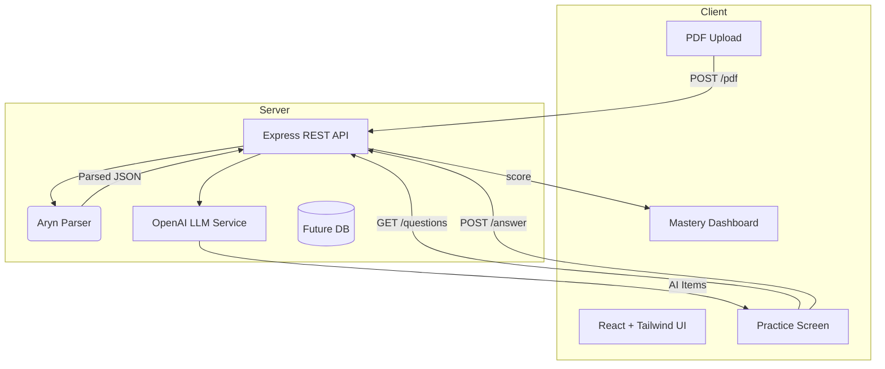

<!-- TITLE & STATUS BADGES -->
# 🎯 **Bullseye**  
 
 

> *“No more guesswork—just the right practice at the right level.”*

---

## 📚 Inspiration
Both in high-school and college, professors and teachers frquently utilize a unique structure for questions on examinations, both in terms of difficulty and problem style. These problems are often far different from problems that any generic textbook or online resource could help one study with . **Bullseye** sprang from the idea of letting students upload a teacher’s past papers(PDF) and instantly getting back drill questions that mimic the same *structure* and *difficulty*, saving hours of blind searching.

---

## 🚀 What Bullseye Does
1. **Upload PDF** Students drag-and-drop previous tests or worksheets.  
2. **AI Question Generator** OpenAI LLM + parsed PDF content → brand-new questions that mirror the teacher’s wording & rigor.  
3. **Adaptive Practice UI** Answers are graded inline; mastery per topic is tracked in real time.  
4. **Personalised Feedback** Immediate hints & a mastery dashboard to focus the next study session.

---

## 🛠️ How We Built It

| Layer | Tech | Why we chose it |
|-------|------|-----------------|
| **Frontend** | React + Vite • Tailwind CSS | Fast dev setup & utility-first styling |
| **Backend** | Node.js • Express.js | Familiar JS stack for rapid API prototyping |
| **AI** | OpenAI LLMs | High-quality question generation & answer analysis |
| **PDF Parsing** | **Aryn** | Structured text extraction from academic PDFs |

High-Level Architecture

---

## 🥊 Challenges We Faced
During development, we faced several key hurdles in bringing the front‐end and back‐end together. Coordinating real‐time communication between our React/Tailwind client and Express API required careful handling of asynchronous requests and error states—particularly around core features like the PDF upload interface and dynamic navigation controls. We iterated on our component structure and refined our REST endpoints until file submissions, progress feedback, and page transitions felt fluid and reliable. Integrating third-party services was difficult as well. We worked through authentication and rate-limiting concerns to weave Aryn’s PDF‐parsing engine and OpenAI’s content‐generation APIs into our workflow. Ensuring that raw documents could be ingested, parsed, and transformed into meaningful study prompts demanded both architectural foresight and extensive testing. 

---

## ✨ Accomplishments
If you had told us 48 hours earlier that two classmates with **zero full-stack background** would have a live demo to show, we would’ve laughed. None of us had ever spun up a React app, written an Express route, or called the OpenAI API in anything beyond a playground. Yet by Sunday afternoon Bullseye could **swallow a PDF, talk to Aryn, get fresh questions from GPT-4o, and display a mastery dashboard**—all in one click. The win wasn’t polished visuals or a trophy; it was proving to ourselves (and, we hope, to anyone reading this) that raw curiosity and late-night persistence can turn “Hey, wouldn’t it be cool if…?” into a working product.

---
## 💡 What We Learned
Most hackathon recaps list technologies; we discovered something bigger: the thrill—and terror—of shipping when you have no idea what you’re doing. We learned how to google error messages at 3 a.m., how to keep a server from panicking when two teammates push conflicting code, and how to breathe when an API key fails 15 minutes before judging. More importantly, we learned that inexperience isn’t a drawback—it’s an accelerant. Each bug we squashed and endpoint we hooked up reinforced that we could actually build something end-to-end—and now, starting a new project feels like an opportunity, not a roadblock.

---
